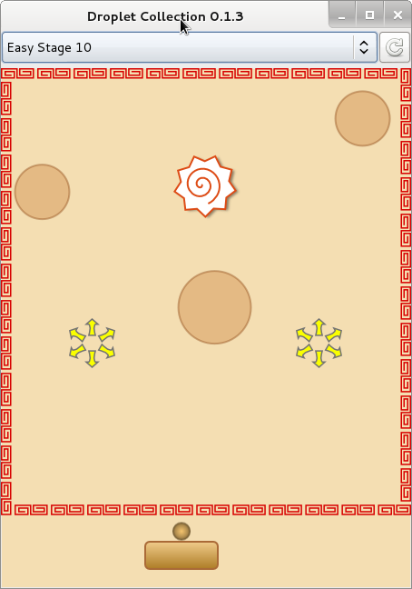

Droplet Collection
==================

Droplet Collection はブロック崩し風のくだらないミニゲームです．
ボールを打ち出して，油滴を集めて下さい．

もともと，ラーメンを食べ終わった後に，油を集める行為をゲーム化しようと思ったのですが，
何故かこんなものができてしまいました．

Install
-------

以下のコマンドで，コンパイル & インストールできます．
コンパイルには gtkmm-2.4 が必要です．

    $ ./configure
    $ make
    # make install

インストールしたら，次のコマンドで実行できます．

    $ droplet-collection
